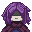
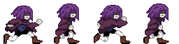
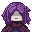

# 
 Jogo-De-Navegador (jump jump)

Um jogo de **endless runner** (corrida infinita) baseado em ambiente web, inspirado no jogo do *Dinossauro do Google* e *Super Chicken Jumper*. O jogo conta com a mecânica de pulo(por enquanto), desvio de obstaculos, Score e Timer em tempo real e sistema de Best Score(Melhor Pontuação).

Todo estilo visual foi desenvolvido com arte própria, utilizando animação baseada em sprite-sheets.

---

## Funcionalidades Atuais

* **HUD em Tempo Real:** Monitoramento de Score (Pontuação atual), Timer (Tempo de Sobrevivência) e Best Score (Maior Pontuação).

* **Sistema de Recorde:** O jogo válida se o jogador superou seu recorde pessoal anterior, exibindo na tela de Game Over.

* **Animação por Spritee-Sheet:** O personagem principal possui animação de corrida baseada em 4 frames.

 

 

---

## Estrutura 

* **HTML:** Estrutura e Marcação dos elementos do jogo (HUD, Board, Game Over)

* **CSS:** Estilização arcade, fontes, tamanhos da tela e KeyFrames de animação.

* **JS:** Lógica de jogo (Loops, colisões, score e estados do jogo).

* **Assets:** Nela esta presente o Sprite-sheet do personagem principal e um único sprites do obstaculo (espinho).

---

##  Futuras Implementações

Pretendo adicionar mais funções ao projeto. Estas sao todas as funcionalidades planejadas nos próximos commits.

* **[]MenuPrincipal:** Tela inicial com botão de Play e instruções.

* **[]Gerenciamento de Save:** Opção para Resetar o Best Score.

* **[]Batalha de Chefe(Boss):** Ativar um Boss especial assim que o Timer atingir uma marca especifica de segundos.

* **[]Variedade de Inimigos:** Adicionar mais 2 tipos de inimigos diferentes, para quebrar a previsibilidade.

* **[]Sistema de Aleatoridade:** Gerar espinhos e novos inimigos em intervalos diferentes e randomicos.

* **[]Arte Background Dinâmico:** Implementação de um cenario de fundo, para trazer um visual mais atraente.

* **[]Keyboard e Opçoes do Jogador:** Por enquanto por falta de opções não existe botões específicos, então qualquer tecla serve para pular, sendo assim futuramente terá mais opções do jogador usar para sobreviver, como agachar, guarda 2 items, e uma arma.

---

## Status do Projeto e Contexto Atual

>Nota de Desenvolvimento: O projeto se encontra em prototipo funcional, significa que a lógica do jogo (loop, colisão e score) esta pronto, mas a experiencia de gameplay ainda esta no estado mais bruto.

O que esperar da versão atual:

- **Sem curva de Dificuldade:** A velocidade dos espinhos e estática e constante. A logica randomica e velocidade progressiva ainda não foram implementadas.

- **Controles Universais:** Por enquanto **Qualquer Tecla**, aciona o comando de pulo. O sistema de teclas especificas sera finalizado junto com o sistema de combate.

## Como Jogar

1 - Clone o repositório

2 - Na pasta do projeto abra o arquivo index.html no navegador, ou use a extensão **Live Server** no VS Code para rodar localmente

3 - Por não limitar o jogador no quesito botão especifico para pular, qualquer botão faz a ação (por enquanto).

 

